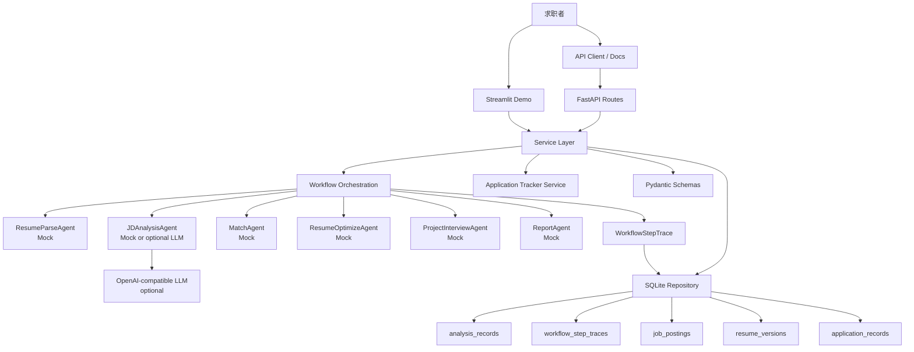

# JobAgent

JobAgent 是一个面向求职者的本地求职准备工作台，核心目标是把“简历和 JD 是否匹配、应该怎么改、面试会被怎么追问、投递进展到哪一步”变成可结构化记录和复盘的流程。

当前版本已经从 Mock MVP 推进到可运行的本地工作台：支持 Streamlit Demo、FastAPI 后端、SQLite 分析记录、岗位库查询、txt/md 简历文件解析、可选 LLM JD 分析、workflow 执行轨迹持久化，以及投递 tracker 最小状态机。

```text
简历文本或 .txt/.md 简历文件 + JD 文本
  -> 简历文件转纯文本（可选）
  -> 结构化简历解析
  -> JD 分析
  -> 匹配报告
  -> 简历优化建议
  -> 项目面试追问
  -> Markdown 报告 + 执行轨迹
  -> 可选保存到 SQLite / 历史复盘 / 加入投递跟进
```

## 项目边界

当前重点是求职准备、复盘和展示，不做平台自动化。

已完成：

- Streamlit 页面：生成报告、历史记录、岗位库、简历版本、投递跟进和执行轨迹展示。
- FastAPI 后端：分析、简历解析、JD 分析、匹配、报告、记录、岗位、投递 tracker API。
- 简历文件解析：支持 `.txt` / `.md` UTF-8 文件转纯文本，并复用 `ResumeParseAgent` 输出 `ResumeProfile`。
- Pydantic schema：稳定 Agent、service、API、UI 之间的数据流。
- Mock pipeline：不依赖真实 LLM 也能端到端运行。
- Workflow 编排层：记录主链路步骤、Agent 模式和 guardrails，为后续 LangGraph 迁移做准备。
- LangGraph 迁移准备：用 `WorkflowGraphSpec` 固定 node、edge、state reads/writes 和迁移契约。
- Agent 边界：ResumeParse、JDAnalysis、Match、ResumeOptimize、ProjectChallenge、Report 都有独立入口。
- Agent Trace：每步记录 `mock`、`llm` 或 `fallback` 模式、fallback 原因、耗时和 guardrails。
- 可选 LLM JDAnalysisAgent：调用失败或未配置 API key 时回退 mock。
- SQLite 存储：保存分析记录、岗位 JD、匹配报告、项目追问、带 run id/耗时的 workflow step trace、简历版本和 tracker。
- 简历版本管理：保存原始简历、定制后文本，并可关联目标岗位和投递记录。
- pytest 测试：覆盖 mock pipeline、API、存储、LLM fallback、workflow trace 持久化、简历版本和投递 tracker。

明确不做：

- 自动投递。
- 招聘网站登录。
- 验证码处理。
- 复杂爬虫和反爬绕过。
- 多用户权限系统。
- 编造简历经历、公司、项目、数据或技术栈。
- PDF/DOCX 简历解析（后续计划，当前不引入大型文档解析依赖）。

## 架构图



分层原则：

- `frontend/` 只做展示和触发，不写核心业务逻辑。
- `app/api/` 只做请求响应和 schema 边界。
- `app/services/` 负责编排业务流程。
- `app/agents/` 放可替换的 Agent 能力。
- `app/storage/` 集中处理 SQLite 连接和 repository。
- `app/schemas/` 用 Pydantic 约束所有核心结构。

## 快速运行

### 1. 安装依赖

```powershell
pip install -r requirements.txt
```

如果使用项目虚拟环境：

```powershell
.venv\Scripts\python.exe -m pip install -r requirements.txt
```

### 2. 启动 Streamlit Demo

```powershell
.venv\Scripts\python.exe -m streamlit run frontend/streamlit_app.py
```

页面包含：

- 生成报告：粘贴简历文本，或上传 `.txt` / `.md` 简历文件，再输入 JD，输出 Markdown 报告和执行轨迹。
- 历史记录：查看已保存的分析结果和每次 workflow step trace。
- 岗位库：查看保存过的 JD 和结构化分析。
- 简历版本：保存针对不同岗位定制的简历版本。
- 投递跟进：对岗位记录状态、备注、下一步行动和简历版本。

### 3. 启动 FastAPI 后端

```powershell
.venv\Scripts\python.exe -m uvicorn app.main:app --reload
```

打开接口文档：

```text
http://127.0.0.1:8000/docs
```

常用接口：

```text
GET  /health
POST /analyze/full
POST /resume/parse-file
GET  /records
GET  /jobs
GET  /resume-versions
GET  /applications
POST /resume-versions
POST /applications
PATCH /applications/{application_id}
```

### 4. 可选启用 LLM JD 分析

当前只有 `JDAnalysisAgent` 支持可选 LLM。未配置 API key 或调用失败时，系统自动回退 mock JD 分析。

```powershell
$env:JOBAGENT_LLM_API_KEY="your-api-key"
$env:JOBAGENT_LLM_BASE_URL="https://api.openai.com/v1"
$env:JOBAGENT_LLM_MODEL="gpt-4o-mini"
```

然后在 Streamlit 侧边栏勾选“启用 LLM JD 分析”。

### 5. 运行测试

```powershell
.venv\Scripts\python.exe -m pytest
```

当前验证重点：

- Mock pipeline 是否能端到端产出报告。
- LLM JDAnalysisAgent 是否能失败回退。
- FastAPI route 是否保持薄封装。
- SQLite 存储是否使用临时库测试。
- Application tracker 是否能创建、筛选和更新状态。
- Workflow step trace 是否能随分析记录保存并在详情中读取。

## Demo 展示路径

推荐演示顺序：

1. 在“生成报告”页粘贴样例简历和 JD。
2. 勾选“保存本次分析”，生成 Markdown 报告，并展示每个 Agent 的执行轨迹。
3. 进入“历史记录”，展示同一次分析可以被检索、查看报告和复盘 workflow trace。
4. 进入“岗位库”，展示 JD 已被结构化保存，并保留原始 JD。
5. 进入“简历版本”，保存一个针对目标岗位的定制版本。
6. 进入“投递跟进”，把目标岗位标记为 `interested` 或 `applied`，并关联简历版本。
7. 打开 FastAPI `/docs`，展示同一套能力已经可以通过 API 调用。
8. 运行 `pytest`，说明核心流程由测试保护，而不是只靠手动点击页面。

样例数据：

- `data/samples/sample_resume.md`
- `data/jd_examples/sample_jd.md`

更完整的演示脚本见 [Demo Guide](docs/DEMO_GUIDE.md)。

## 阶段路线

| 阶段 | 目标 | 状态 |
| --- | --- | --- |
| Phase 0 | 文档层、项目边界、AI 辅助开发规则 | 已完成 |
| Phase 1 | Mock MVP，跑通简历 + JD 到报告的主链路 | 已完成 |
| Phase 2 | 可选 LLM JDAnalysisAgent，失败回退 mock | 已完成 |
| Phase 3 | FastAPI 后端，拆出可复用 API 层 | 已完成 |
| Phase 4 | SQLite 分析记录、岗位库基础查询 | 已完成 |
| Phase 5 | Streamlit 历史记录、岗位库、投递 tracker | 已完成 |
| Phase 6 | README、Demo、架构图、作品集展示材料 | 已完成 |
| Phase 7 | 简历版本管理，关联岗位和 tracker | 已完成 |
| Phase 8 | 显式 Workflow 编排层，为 LangGraph 做准备 | 已完成 |
| Phase 9 | Workflow trace 持久化，支持历史记录复盘每个 Agent 步骤 | 已完成 |
| Phase 10 | Workflow observability cleanup，补 run id、耗时和 trace 摘要展示 | 已完成 |
| Phase 11 | LangGraph migration prep，固定 node 映射和迁移契约 | 已完成 |
| Phase 12 | Resume File Parser MVP，支持 txt/md 简历文件转纯文本并复用 ResumeParseAgent | 已完成 |
| Phase 13 | LangGraph 原型、RAG 检索、MCP 工具封装 | 后续 |
| Phase 14 | Docker、部署说明、答辩材料和截图 | 后续 |

## 面试讲述版

可以这样介绍这个项目：

```text
JobAgent 是一个求职准备工作台。我没有一开始做自动投递，而是先解决更核心的问题：
求职者如何判断自己的简历和目标 JD 的差距，并把每次分析、优化和投递动作记录下来。

技术上我先用 Pydantic schema 固定输入输出，再用 mock pipeline 跑通端到端闭环。
这样即使没有真实 LLM，系统也能稳定生成匹配报告、简历优化建议和项目追问。
之后我只把 JDAnalysisAgent 替换成可选 LLM，并保留 mock fallback，避免模型输出不稳定影响主流程。

工程上我把 UI、API、service、agent、storage 分层。
Streamlit 负责 Demo 展示，FastAPI 负责接口，SQLite 负责本地持久化，
tracker 负责记录求职状态，但不碰招聘网站登录、验证码和自动投递。
同时每次端到端分析都会保存 workflow step trace，可以回看每个 Agent 使用的是 mock、LLM 还是 fallback，
也能看到同一次 workflow run 的 ID 和每个步骤耗时，
这让系统不只是能生成结果，也能解释结果是怎么来的。

这个项目的重点不是堆概念，而是展示一个 AI 应用从需求边界、结构化数据流、
可替换 Agent、失败回退、存储复盘到测试验证的完整工程过程。
```

面试官可能追问：

- 为什么第一版不用 LangGraph？
- 为什么 LLM 只先替换 JDAnalysisAgent？
- 如何防止简历优化时编造经历？
- API route 和 service 的边界是什么？
- SQLite 为什么适合作为当前阶段存储？
- tracker 为什么依赖岗位库，而不是手动新建任意岗位？
- 如何证明某次分析真的用了 LLM，或者发生了 fallback？
- 为什么先做 `WorkflowGraphSpec`，而不是直接把主流程替换成 LangGraph？
- 后续如果多用户化，需要改哪些表和接口？

## 目录结构

```text
app/
  main.py
  agents/
    jd_analysis_agent.py
    match_agent.py
    project_challenge_agent.py
    report_agent.py
    resume_optimize_agent.py
    resume_parse_agent.py
    types.py
  api/
    routes_analyze.py
    routes_applications.py
    routes_jobs.py
    routes_match.py
    routes_records.py
    routes_reports.py
    routes_resume.py
    routes_resume_versions.py
  schemas/
    api.py
    application.py
    job.py
    match.py
    report.py
    resume.py
    resume_version.py
  services/
    application_service.py
    llm_service.py
    mock_pipeline.py
    report_service.py
    resume_file_service.py
    resume_version_service.py
    storage_service.py
  storage/
    database.py
    repositories.py
  workflows/
    job_analysis_workflow.py
frontend/
  streamlit_app.py
tests/
  test_api.py
  test_agents.py
  test_application_tracker.py
  test_jd_analysis_agent.py
  test_mock_pipeline.py
  test_resume_file_service.py
  test_resume_versions.py
  test_storage.py
data/
  samples/
  jd_examples/
docs/
.ai/
```

## 关键文档

- [Development Review Guide](docs/DEVELOPMENT_REVIEW_GUIDE.md)
- [Demo Guide](docs/DEMO_GUIDE.md)
- [Agent Boundaries](docs/AGENT_BOUNDARIES.md)
- [Agent Trace](docs/AGENT_TRACE.md)
- [Git Workflow](docs/GIT_WORKFLOW.md)
- [API](docs/API.md)
- [SQLite Storage](docs/STORAGE.md)
- [Streamlit App](docs/STREAMLIT_APP.md)
- [Application Tracker](docs/APPLICATION_TRACKER.md)
- [Resume Versioning](docs/RESUME_VERSIONING.md)
- [Resume File Parser](docs/RESUME_FILE_PARSER.md)
- [Workflow Architecture](docs/WORKFLOW_ARCHITECTURE.md)
- [Workflow Trace Persistence](docs/WORKFLOW_TRACE_PERSISTENCE.md)
- [LangGraph Migration Prep](docs/LANGGRAPH_MIGRATION_PREP.md)
- [LLM Integration](docs/LLM_INTEGRATION.md)
